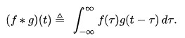

# Hardware Oriented Signal Processing - Armin Niedermüller, Ahmet Cihat Bozkurt
Using convolution for Image-Processing such as Filtering, Edge Detection. Convolutionional Neural Networks

# Introduction

The convolution f \* g is a mathematical operation on two functions f and g. The function g is mirrored on and then then shifted (both on the x-axis) over the function f.
The result of f \* g  is the value of the area between the two overlapping functions f and g at each point when shifting g over f. The following image gives an intuitive idea 
about what the convolution is doing:

\
Image Source: wikipedia\

# Applications
## Blur / Denoising (C++ / Python)
Ahmet
## Canny Edge Detection (C++ / Python)
Armin
## Sobel Edge Operator (C++ / Python)
Ahmet
## Laplace operator (C++ / Python)
Armin
## Hough Line/Circle Transform (C++ / Python)
Armin

## Artificial Intelligence / Deep Learning
#### Convolutional Neural Networks
#### Image Classification with CNNs and Tensorflow 2.0 / Keras	

## Audio Processing
Ahmet
### Cross-Correlation
Ahmet
### Auto-Correlation
Ahmet

# Showcase Convolution
